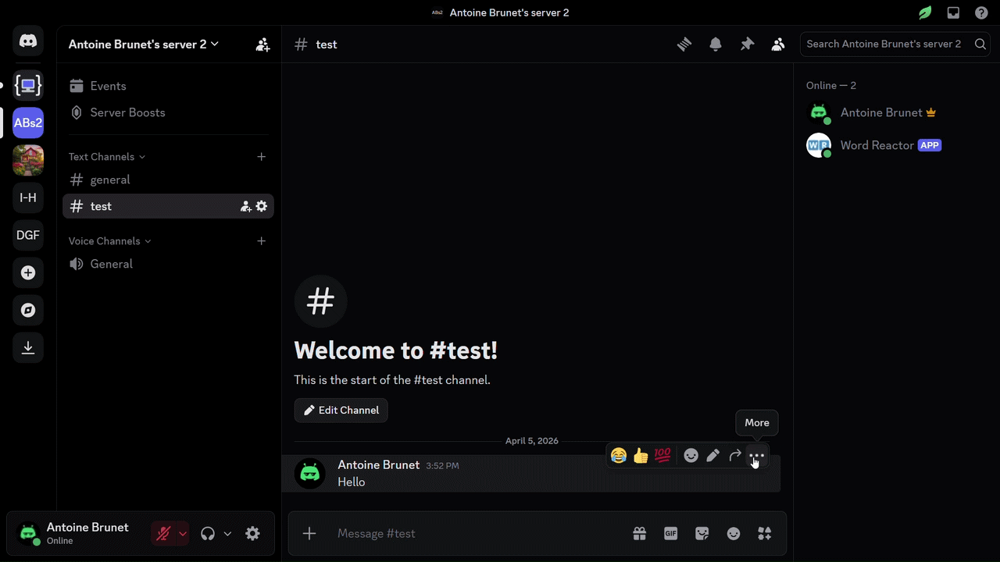

<h1 align="center">
   <picture>
      <source srcset="https://fonts.gstatic.com/s/e/notoemoji/latest/1f916/512.webp" type="image/webp">
      
   </picture> Word Reactor <picture>
      <source srcset="https://fonts.gstatic.com/s/e/notoemoji/latest/1f916/512.webp" type="image/webp">
      
   </picture>
</h1>

<p align="center">
  
  <br>
  ⚡ <b>Python Discord bot that reacts to messages with given words using emoji letters</b> ⚡
  <br>
</p>

<p align="center">
  <a href="CONTRIBUTING.md" target="_blank">Contributing guidelines</a>
  ✦
  <a href="https://github.com/antoinebrunet1/word-reactor/issues" target="_blank">Submit an issue</a>
  ✦
  <a href="https://github.com/antoinebrunet1/word-reactor/discussions" target="_blank">Ask a question</a>
  <br>
  <br>
</p>

<div align="center">

<a href="https://github.com/psf/black/blob/main/LICENSE"></a>  [](https://github.com/antoinebrunet1/word-reactor/actions/workflows/build.yml) [](https://github.com/antoinebrunet1/word-reactor/actions)      <a href="https://github.com/psf/black"></a>  [](#) [](#)  [](#)   [](#)  	    [](#) 

</div>

<hr>

## 📚 `src/main.py` documentation 📚

The `src/main.py` documentation is available at [this link](https://antoinebrunet1.github.io/word-reactor/). It is generated and deployed as part of the GitHub Actions pipeline that is triggered on every push and pull request on the `main` branch.

## 📂 Codebase overview 📂

### [`.github/workflows/build.yml`](.github/workflows/build.yml)

This is the GitHub Actions configuration file.

### [Python files](https://github.com/search?q=repo%3Aantoinebrunet1%2Fword-reactor+path%3A*.py&type=code)

[`test/test_main.py`](test/test_main.py) contains the unit tests. [`src/webserver.py`](src/webserver.py) contains the code needed for Render (the service used for hosting the bot). The rest of the Python code is in [`src/main.py`](src/main.py).

### [`requirements.txt`](requirements.txt)

This file was added for hosting purposes. It contains all the dependencies of the project.

### [`Makefile`](Makefile)

This file is used in [`.github/workflows/build.yml`](.github/workflows/build.yml) but can also be used locally.

To install the `make` command on Windows, [install Chocolatey](https://chocolatey.org/install) and run the command

```
choco install make
```

## 💻 Local setup 💻

1. Create a test bot on Discord's website. You can watch [this YouTube tutorial](https://youtu.be/CHbN_gB30Tw?si=ufaBzNO-E4dsEgf6). This test bot will be used to test your local code.
2. Install Python 3.
3. Run the following command to install the pip dependencies:

   ```
   python3 -m pip install black pydocstyle discord.py pytest pytest-mock python-dotenv pytest-asyncio pytest-cov pdoc radon
   ```
4. Fork the repository.
5. Add a **non-public** file called `.env` with this content:

    ```
    BOT_TOKEN=
    SERVER_ID=
    ```
   Put your values to the right of the two `=`. The first value is the token of the test bot. The second value is the ID of a server where you want to test your local code using the test bot. You need to add the test bot to that server. You can watch [this YouTube tutorial](https://youtu.be/CHbN_gB30Tw?si=ufaBzNO-E4dsEgf6) to see how to add the test bot to the server.
6. Run the bot by running `src/main.py`. You can use the command

   ```
   python3 src/main.py
   ```
   
   or

   ```
   make run_project
   ```

:warning: **Warning:** Do not push `.env` because it contains your bot token.

## ⚙️ Usage ⚙️

You can add the bot to your server using <a href="https://discord.com/oauth2/authorize?client_id=1488295878849597581" target="_blank">this link</a>.

It contains 1 slash command named `react` that takes two parameters:

1. `message_id`
2. `word`

`message_id` is the ID of the message you want the bot to react to. It can be copied from the same contextual menu used to reply to a message.

`word` is the word you want the bot to react with. No letter should repeat.

### ▶️ Demo ▶️



## ✨ Code quality guarantied ✨

The `main` branch of this repository contains a GitHub Actions CI/CD pipeline to indicate if the code meets the below quality checks or not.

1. The <a href="https://pypi.org/project/black/" target="_blank">Black</a> style is respected for every Python file.
2. The Python documentation is valid.
3. The coverage of the unit tests is at least 80%.
4. The cyclomatic complexity is not over 15.

## 🛡️ Safety guarantied for all the dependencies 🛡️

This project uses Dependabot to automatically open PRs for security issues and also for general library version updates.

## ⏰ Reduced execution time for the pipeline ⏰

This repository uses a custom Docker image located on Docker Hub for every job of the GitHub Actions pipeline. That image has been built using the `Dockerfile` file located at the root of this repository before being pushed to Docker Hub. The reason for using this custom image instead of `ubuntu:latest` is that the custom image already has the `pip` dependencies installed which means that they do not need to be installed every time the pipeline runs.

If changes are made to `Dockerfile`, the local and remote images can be deleted from Docker Desktop and the new image specified in `Dockerfile` can be pushed to Docker Hub using the command

```
make push_docker_image
```

## 🔒 `main` branch protection 🔒

The `main` branch is protected by a ruleset called "No deletions and force push for main".

## 🌐 Hosting 🌐

This bot is hosted using Render. UptimeRobot is used to keep it alive.